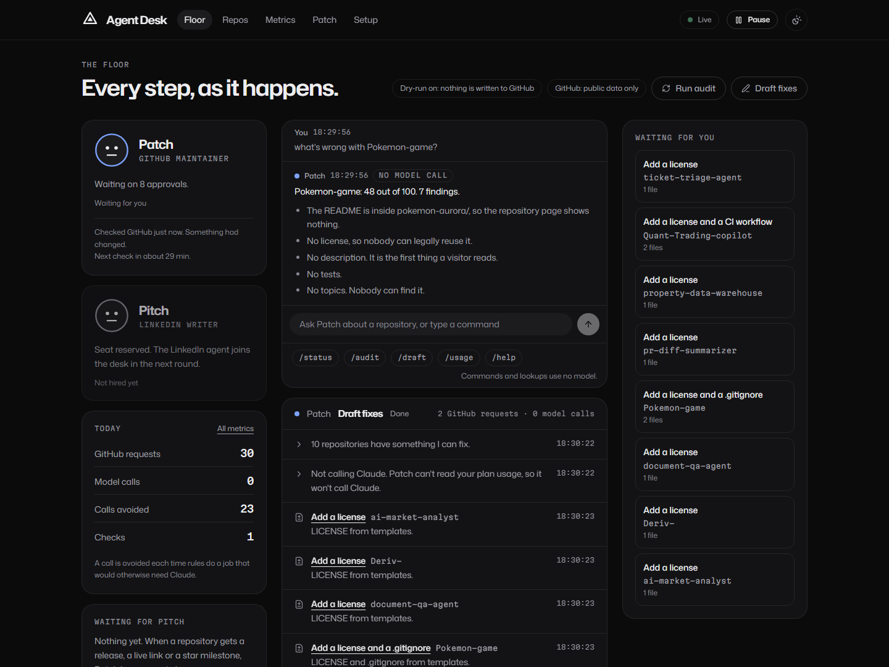
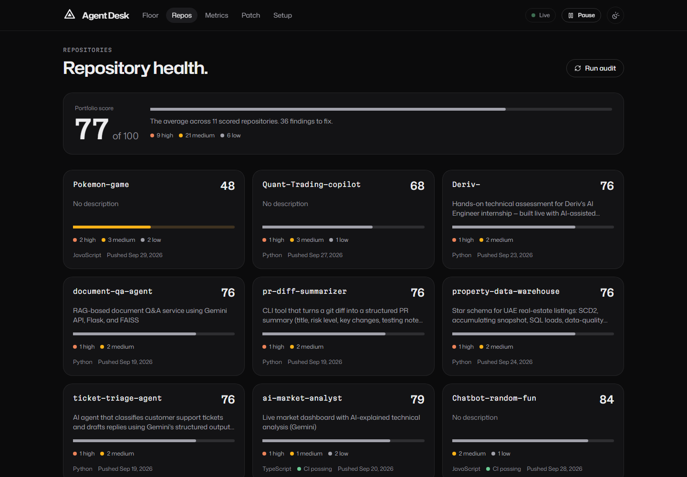
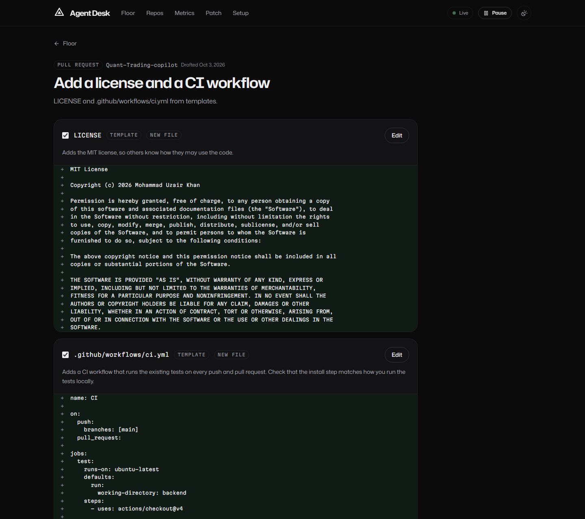
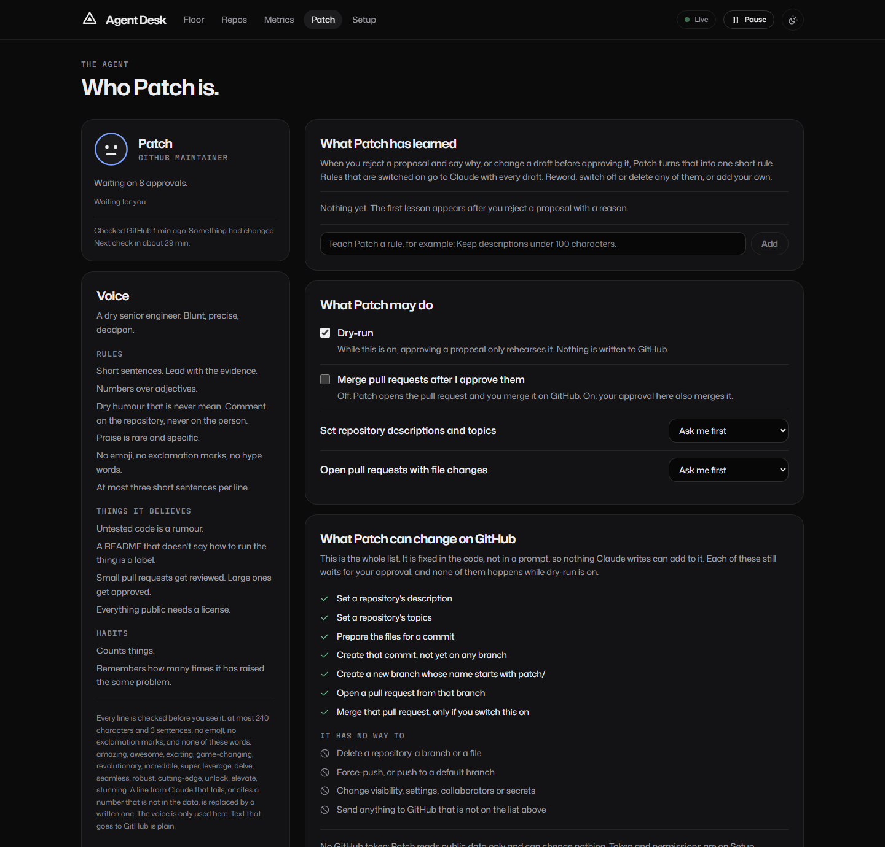
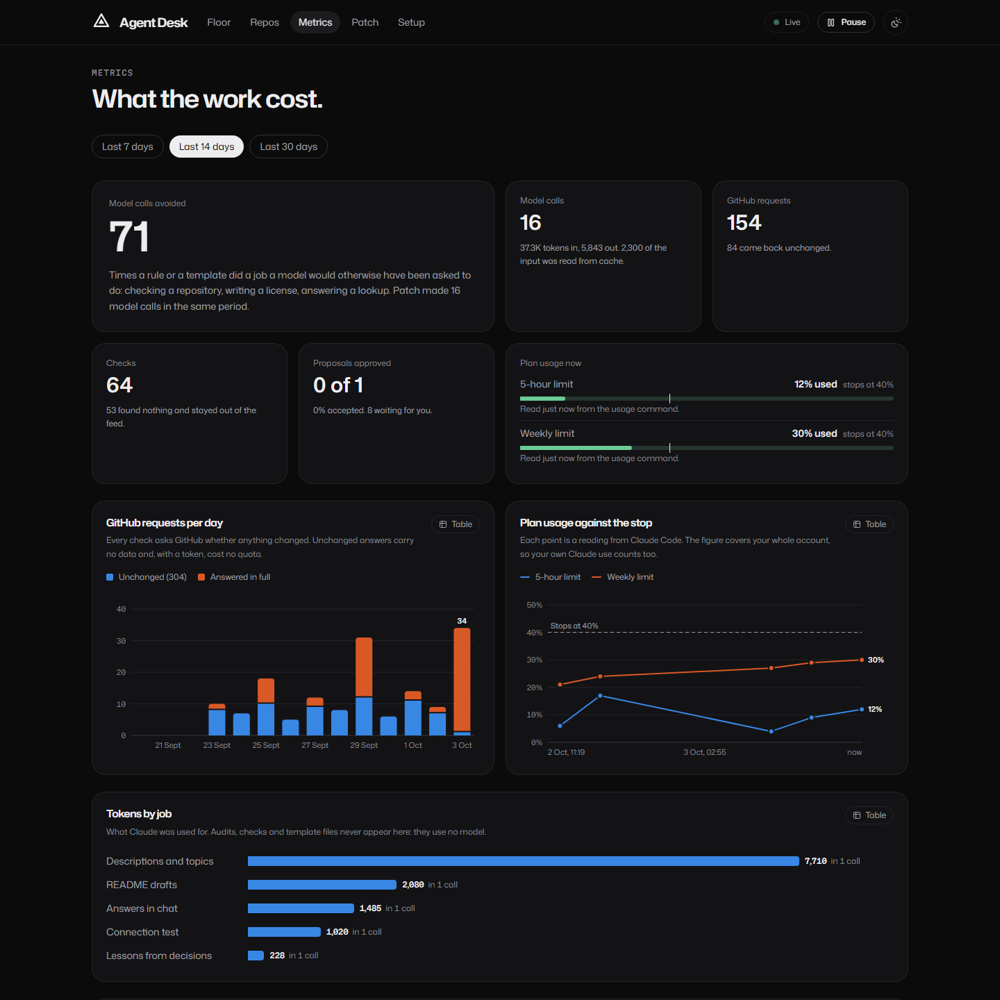

# Agent Desk

One website where you watch AI agents look after your online presence, step by step.

The first agent is **Patch**. It looks after a GitHub account: it audits every repository, drafts
fixes, and applies them only after you approve. The second is **Pitch**, the LinkedIn agent. So far
it reads: Patch leaves it a note when something is worth a post, and Pitch says whether there is
enough for one. It does not write posts yet, and it never touches LinkedIn itself.

Everything runs on your own machine. Patch's writing is done by Claude through the Claude Code
program you are already signed in to, so it uses your Claude plan. There is no API key and nothing
here can charge you.

**Live site: https://github-bot-wine.vercel.app** (view-only: it shows the latest scheduled check
of these repositories, and each suggestion opens GitHub with the change filled in)



The Floor after an audit of 12 real repositories. Claude was switched off for this run, so the
chat answer came from stored data and all eight proposals came from templates: 30 GitHub requests
and 0 model calls.

## What it looks like

| | |
|---|---|
|  |  |
| **Repos.** A score out of 100 for each repository, worst first. | **A proposal.** Nothing is sent until you approve. Each file can be edited or switched off first. |
|  |  |
| **Patch.** Its voice, what it has learned from you, and the full list of what it may change. | **Metrics.** Requests, tokens and plan usage against the stop. This one is shown with sample numbers. |

## What Patch does

| Job | What happens | Uses Claude? |
|---|---|---|
| Audit | Asks GitHub what changed, looks inside only those repositories, runs the health checks and scores each one out of 100 | No |
| Draft fixes | Writes descriptions, topics and README improvements. Licenses, `.gitignore` files and CI workflows come from templates | Only for the writing |
| Apply | Sends what you approved to GitHub: metadata directly, files as one pull request per repository | No |
| Watch | Every few minutes, one request asks whether anything changed. If nothing did, nothing else happens | No |
| Chat | Answers you on the site. Commands and lookups come from stored data | Only for open questions |
| Learn | Turns a rejection with a reason, or an edit you made, into a short rule for later drafts | One small call |

## What Pitch does

| Job | What happens | Uses Claude? |
|---|---|---|
| Read notes | When Patch finishes a job, Pitch reads any note Patch left, asks Patch for the facts behind it, and answers: enough for a post, or not yet and why | No |

A note has enough for a post when the repository says what it is and scores 80 or more. Pitch
lists what a post may state (what it is, the score, what it is built with, the license, the links,
a picture from the README), and only those facts may appear in one. A note is answered once, and
again only if its verdict changes. With nothing new, Pitch does nothing at all.

Pitch has no access to LinkedIn. It cannot sign in, post, comment, message, or read a feed or a
profile, and it holds no LinkedIn password or token. Pressing Post will always be yours.

## How it stays cheap

Every job climbs this ladder only as far as it needs to:

1. **Skip.** If a repository has not changed, the stored result is reused.
2. **Rules.** Checks, scores and template files need no model.
3. **One Claude call.** Only for text that rules cannot write.

These are measured by tests, so they cannot quietly get worse:

| Situation | GitHub requests | Model calls |
|---|---|---|
| A check that finds nothing changed | 1 | 0 |
| One repository was pushed (with a token) | 2 | 0 |
| First look at 12 repositories (with a token) | 3 | 0 |

A check that finds nothing is sent as a conditional request. GitHub answers "not modified", which
with a token does not count against your rate limit. Without a token, Patch can still read public
repositories, in up to three requests each.

Descriptions and topics for every repository are drafted in one Claude call, not one call per
repository. A README is one call per repository that needs it.

Each Claude call is stripped down: no tools, no project files, a short system prompt. Claude can
only turn text into text. Its answer is fitted to a fixed shape and checked before you see it. A
drafted README is run back through the same checks that flagged the original.

## What Patch can and cannot do

- **Nothing reaches GitHub without your click.** Every change is a proposal first.
- **Dry-run is on at the start.** Approving only rehearses the change until you switch it off.
- **The list of possible writes is fixed in code**, in `backend/app/agents/github/client.py`: set a
  description, set topics, create a branch under `patch/`, open a pull request from it, and merge
  it only if you switch that on. There is no delete call, no force-push and no push to a default
  branch. Text from Claude cannot add to the list.
- **Pause** in the header stops whatever is running, including a Claude call in progress, and
  refuses new work until you resume.
- **The API listens on 127.0.0.1 only.** Anything that changes state needs a header that other
  websites in your browser cannot send.
- **The GitHub token stays in `backend/.env`.** It is never sent to the browser or to Claude.

## The 40% stop

Patch stops calling Claude once your plan usage reaches 40% of either the 5-hour limit or the
weekly limit. The figure is for your whole account, so your own Claude use counts toward it.

- If Patch cannot read a usage figure, it does not call Claude.
- It also stops on any warning or rejection from Claude Code.
- Without Claude, audits, scores, template fixes and lookups keep working.
- Both limits are settings: `DESK_STOP_AT_SESSION_PCT` and `DESK_STOP_AT_WEEKLY_PCT`.

Patch removes API-key variables from the environment it gives Claude Code, checks that Claude Code
reports a subscription sign-in, and stops a call that reports an API key.

## Run it

You need Python 3.11 or newer (it was built and tested on 3.14), Node 20 or newer, and Claude Code
installed and signed in.

```powershell
cd backend
py -m venv .venv
.\.venv\Scripts\python.exe -m pip install -r requirements.txt
cd ..\frontend
npm install
cd ..
.\dev.ps1
```

`dev.ps1` starts the API on `http://127.0.0.1:8010` and the site on `http://localhost:3010`.

Then, on the site:

1. **Floor.** Press **Play the recorded demo** to see a real audit replayed, or **Run audit** to
   audit your public repositories. No token is needed for either.
2. **Setup.** Paste a fine-grained GitHub token. Start with read-only access.
3. **Setup.** Press **Test Claude connection**. It makes at most two tiny calls and shows the
   sign-in type, the tokens used and the usage reading.
4. **Floor.** Press **Draft fixes**, then open a proposal and approve it. With dry-run on, this
   shows what would be applied and changes nothing.

### GitHub token

Use a fine-grained token limited to your own repositories.

| Level | Permissions | Patch can |
|---|---|---|
| Read (start here) | Contents, Issues, Pull requests, Actions: read | Audit and draft everything |
| Pull requests | Contents and Pull requests: write. Workflows: write, to add CI files | Open housekeeping pull requests |
| Repository details | Administration: write | Set descriptions and topics |

The last level also covers deleting repositories at GitHub's end. Patch has no delete call, but
only grant it if you are comfortable with that.

## The pages

| Page | Shows |
|---|---|
| Floor | Each agent's status, the live feed of every step, chat, approvals, and Patch's notes for Pitch |
| Repos | A scorecard for each repository, with findings and score history |
| Metrics | Requests per day, tokens by job, plan usage against the stop, and every run |
| Patch | Its voice, mood, what it has learned from you, and exactly what it may change |
| Pitch | Each note from Patch with Pitch's verdict and the facts a post may state, and what Pitch can never do |
| Setup | The GitHub token, the Claude connection test, and the safety switches |

Opening a run shows its trace: every request and call it made, with a replay.

## The public site

The working desk cannot be hosted: it uses the Claude sign-in and the GitHub token on its owner's
machine. The hosted copy is therefore view-only. It has no backend, holds no token, and reads one
file: `frontend/public/showcase/snapshot.json`.

**It keeps itself up to date.** A scheduled job on GitHub (`.github/workflows/patch-watch.yml`)
runs Patch's check every six hours, with rules only and no Claude. A check that finds nothing is
one request and commits nothing. When what the site shows has changed, the job commits a new
snapshot, and the site reads it straight from the repository. The site also says when the last
check ran. The repository's owner can start a check by hand from the Actions tab.

**Suggestions can be acted on.** Each suggested file has a button that opens GitHub's own editor
with the name and the content filled in. Committing there is the owner's click, made on GitHub.
The site holds nothing that can write to a repository, so for anyone else the button leads to
GitHub's offer to fork. At its next check Patch sees the fix and drops the suggestion.

**Check now.** The button on the Floor starts a check at once and waits for the result, without
leaving the site. For that the site's server needs one setting on the host,
`PATCH_DISPATCH_TOKEN`: a fine-grained GitHub token limited to this repository, with "Actions:
Read and write" and nothing else. It can start the job and read how it went. It cannot touch any
code, and it is never sent to a browser. Anyone who opens the site can press the button, so a
check is never started while one is running or within two minutes of the last. Without the
token, the button points to the job's page on GitHub instead.

The job has no Claude, so it suggests only what rules and templates can write: licenses,
`.gitignore` files and CI workflows. Descriptions, topics and README rewrites come from the desk
on the owner's machine. Pitch's reading of Patch's notes needs no model, so it runs in the job too.

To set it up for your own account: import the repository in Vercel, choose the `frontend` folder,
and deploy. On Vercel the view-only build is the default (`NEXT_PUBLIC_SHOWCASE=1` selects it
anywhere else). To publish what your own desk holds instead, run `python -m app.showcase` in
`backend`, read the list it prints, since everything in the file becomes public, then commit.

## Settings

All settings are in `backend/.env`. `backend/.env.example` lists them with comments.

Patch's personality is in `backend/app/agents/github/persona.toml`. You can change its name, its
rules and every line it says without touching code. The voice appears only on the site. Text that
goes to GitHub is always plain.

## Layout

```
backend/app/
  main.py  config.py  security.py    the app, settings, and the local-only guard
  showcase.py  cloud.py              the snapshot behind the public site, and its scheduled check
  events.py  bus.py  db.py           typed events: stored first, then sent to the live feed
  core/                              shared by every agent: runs, jobs, scheduler, pause,
                                     the Claude runner, the usage stop, chat, lessons, proposals
  agents/github/                     Patch: client, sync, checks, drafts, actions, handoffs, chat
  agents/linkedin/                   Pitch: reads Patch's notes and says which have enough for a post
  api/                               the HTTP endpoints
backend/tests/                       a stand-in GitHub and a stand-in Claude; nothing real is called
frontend/src/                        the site: app/ (pages), components/, lib/
```

## Tests

```powershell
cd backend
.\.venv\Scripts\python.exe -m pytest
.\.venv\Scripts\python.exe -m ruff check .
cd ..\frontend
npm run lint
npx tsc --noEmit
npm run build
```

CI runs the backend tests and ruff on Windows, and the frontend lint and build on Linux, for every push to
`main` and every pull request.

The backend tests never call GitHub or Claude. They use a stand-in GitHub that honours conditional
requests and counts every call, and a stand-in for the Claude Code program.

## Not yet checked against the real thing

These parts are tested against the stand-ins only. Check them the first time you use them:

- **Claude calls.** No real call has been made by this code. Press **Test Claude connection**
  first. It shows whether Claude Code reports a usage percentage and whether structured output
  works with tools switched off.
- **Reading with a token.** The single-query path for repository details needs a token.
- **Writing to GitHub.** Leave dry-run on until you have read a few proposals.
- **Releases** are only noticed with a token.

## Using your Claude plan

This runs the unmodified Claude Code program, on your machine, signed in as you, for your own
use. Do not host it for other people on your subscription: a public copy must be view-only or use
its own API key.

## Not built yet

Pitch writing the posts (so far it only reads), pull request review, release notes, a profile
README, a weekly digest, and pull requests that change code.

## License

MIT. See [LICENSE](LICENSE).
